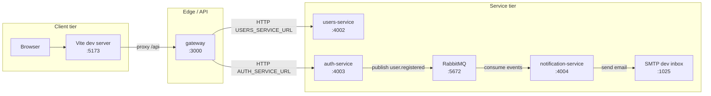
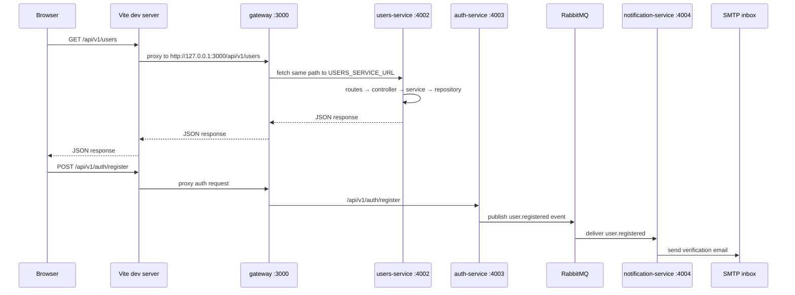

# Architecture and flow (for your understanding)

This file is a **mental map** of the repo: how requests move, what each folder does, and which tools we use. It is not a deployment contract; update it when the code changes.

---

## What this project is

A **monorepo** for a small **microservices-style** setup:

- One **browser client** (React).
- One **API gateway** that forwards HTTP to backend services (no shared database between services).
- One **users microservice**.
- One **auth microservice** (JWT auth, refresh tokens, RBAC, email verification token flow).
- One **notification microservice** (RabbitMQ consumer + email sender with retries/dead-letter).
- A **shared** library for validation schemas and types so services do not duplicate Zod rules.

Communication between client and APIs is HTTP/REST via the gateway, and service-to-service async notifications use RabbitMQ events (`user.registered`, `todo.created`).

---

## Product: features we are building

The **product goal** is a **task manager** with room for **AI-assisted** workflows (naming and future work). The backend is structured as **microservices** so each area can scale and deploy on its own, with **no shared database** between services—only **HTTP APIs** (and, in a fuller setup, **async messaging**) between them.

### Implemented today

| Feature area | What works in code | Notes |
|--------------|-------------------|--------|
| **User directory** | List users in the React client; REST CRUD for users via gateway | `users-service` remains an independent service. |
| **Auth** | Register, login, refresh, logout, `me`, and admin-only endpoint | JWT access + refresh tokens, RBAC middleware (`admin`, `user`), refresh token persistence in DB, bcrypt password hashing. |
| **Email verification** | Verification link generated at registration and sent by notification service | `auth-service` publishes `user.registered`; notification sends clickable verification email. |
| **Event-driven notifications** | Notification consumer handles `user.registered` and `todo.created` | RabbitMQ topic exchange, retry queue, dead-letter queue, failure logging. |
| **API shape** | REST under `/api/v1/...` | Gateway is the single entry from the browser in dev (via Vite proxy). |
| **Validation** | Zod on auth/user request contracts and event payloads | Shared package keeps contracts aligned across services. |
| **Observability (basic)** | Structured JSON logs per process (Winston) | Enough to trace requests and errors in development. |

### Planned / next (not fully built yet)

These match the direction of a **production-grade** task platform; treat them as the roadmap, not as guarantees in every file yet.

| Feature area | Intent |
|--------------|--------|
| **Tasks** | Dedicated **tasks service** (or similar): create, assign, status, due dates—owned by its own DB. |
| **AI** | Separate flow (service or worker) for suggestions, summarization, or task breakdown—likely via API + optional **message queue** so work is async. |
| **Auth hardening** | Email verification expiry strategy, stronger token invalidation policies, auth rate limiting. |
| **Cross-service integration** | Extend RabbitMQ event catalog and contract versioning; add Redis where caching/session acceleration is needed. |
| **Docs & hardening** | **Swagger/OpenAPI**, **rate limiting**, error contracts stable for clients. |

When you add a feature, keep **business logic in services**, **persistence in repositories**, and **HTTP glue in controllers**—that keeps new domains (tasks, AI, notifications) consistent.

---

## Infrastructure

“Infrastructure” here means **what runs**, **how it talks**, and **what you will add** for real environments—not only folders in Git.

### Runtime topology (current)

Everything is **Node.js** processes on your machine (or on servers). There is **no Docker/Kubernetes** in the repo yet; you can add that later using the same ports and env vars.



| Component | Default port | Responsibility |
|-----------|--------------|----------------|
| **client** (Vite) | `5173` | Serves the SPA; in dev, proxies `/api` to the gateway. |
| **gateway** | `3000` | Public API surface for the browser; forwards to internal service URLs. |
| **users-service** | `4002` | Owns user data in this codebase (in-memory until you plug in a database). |
| **auth-service** | `4003` | Owns auth DB tables (users/roles/sessions/audit logs), JWT issuance, refresh/logout, email verification token handling. |
| **notification-service** | `4004` | Consumes RabbitMQ events and sends templated emails with retry/dead-letter handling. |
| **rabbitmq** | `5672` | Topic exchange for async events (e.g., `user.registered`, `todo.created`). |
| **SMTP dev inbox** | `1025` (UI often `8025`) | Local mail sink for testing outbound emails. |

**Environment variables (today)**

| Variable | Where | Purpose |
|----------|--------|---------|
| `PORT` | gateway, users-service, auth-service, notification-service | Listen port (defaults above if unset). |
| `USERS_SERVICE_URL` | gateway | Base URL of the users microservice (default `http://127.0.0.1:4002`). |
| `AUTH_SERVICE_URL` | gateway | Base URL of auth microservice (default `http://127.0.0.1:4003`). |
| `DATABASE_URL` | auth-service | Postgres connection string for auth tables. |
| `JWT_ACCESS_SECRET`, `JWT_REFRESH_SECRET` | auth-service | Signing keys for access and refresh tokens. |
| `RABBITMQ_URL`, `EVENT_EXCHANGE_NAME` | auth-service, notification-service | Event bus connectivity and exchange name. |
| `SMTP_HOST`, `SMTP_PORT`, `EMAIL_FROM` | notification-service | Outbound email transport config. |
| `LOG_LEVEL` | all Node services | Winston log level (e.g. `info`, `debug`). |

### Data and ownership

- **Per microservice database pattern:** `auth-service` already uses Postgres + Prisma for auth-specific tables. `users-service` still uses in-memory storage as a stand-in.
- **Shared nothing at persistence layer:** services do not query each other’s DB; integration is HTTP via gateway and RabbitMQ events.

### Target production infrastructure (roadmap)

When you move beyond local dev, a typical layout would look like this (conceptual):

| Layer | Examples | Role |
|-------|-----------|------|
| **Edge** | Load balancer, TLS termination | Terminates HTTPS, routes to gateway(s). |
| **Gateway** | One or more gateway replicas | Stable `/api/v1` entry, routing, future auth/rate limits at the edge. |
| **Services** | `users-service`, future `tasks-service`, etc. | Horizontally scaled pods/VMs; each with its own DB connection pool (singleton). |
| **Data** | PostgreSQL (or similar) **per service** | Strong boundaries; migrations owned by each service. |
| **Cache / sessions** | **Redis** | Optional: sessions, rate-limit buckets, hot reads. |
| **Async** | **RabbitMQ** (or cloud queue) | Service-to-service events without synchronous HTTP chains. |
| **Observability** | Log aggregation, metrics, tracing | Extends today’s Winston logs with centralized search and alerts. |

Nothing in that table is mandatory on day one; it is the **infrastructure story** that matches the microservice rules you want long term.

---

## Folder map

| Path | Role |
|------|------|
| `shared/` | **`@task-manager/shared`** — Zod schemas and types (safe for the client). **`@task-manager/shared/server`** — Winston, Express middleware, env loader, `HttpError`, `asyncHandler`, utils (Node/gateway only). |
| `services/users-service/` | **Users** microservice: Express app, clean architecture layers, in-memory user store (replace with a real DB later). |
| `services/auth-service/` | **Auth** microservice: Express + Prisma + JWT access/refresh tokens + RBAC + email verification token flow; publishes `user.registered` to RabbitMQ. |
| `services/notification-service/` | **Notification** microservice: RabbitMQ consumer + nodemailer templates + retry/dead-letter queues + failure logging. |
| `gateway/` | **API gateway**: Express app that proxies `/api/v1/users` and `/api/v1/auth`; exposes `GET /health`. |
| `client/` | **SPA**: **Vite** + **React** + TypeScript. In dev, Vite proxies `/api` to the gateway so the browser stays same-origin. |
| Root `package.json` | **npm workspaces** wire all packages together; `npm run build` builds in dependency order. |

---

## End-to-end request flow

Typical flow when you use the UI in development:



**Ports (defaults):**

- Client (Vite): `5173`
- Gateway: `3000` (`PORT`)
- Users service: `4002` (`PORT`)
- Auth service: `4003` (`PORT`)
- Notification service: `4004` (`PORT`)

**Environment:**

- Gateway reads `USERS_SERVICE_URL` and `AUTH_SERVICE_URL`.
- Auth and notification services read `RABBITMQ_URL` and `EVENT_EXCHANGE_NAME`.

---

## Clean architecture inside `users-service`

Each HTTP feature is split so responsibilities stay clear:

```text
routes/        →  wires HTTP paths + middleware (e.g. Zod validation)
     ↓
controllers/   →  HTTP only: call service, set status, forward errors with next(err)
     ↓
services/      →  business rules (e.g. “not found” → error with statusCode)
     ↓
repositories/→  persistence (today: in-memory Map; later: your DB client)
domain/        →  plain TypeScript types / entities (no Express)
middleware/    →  (optional) service-only middleware; shared validation/errors live in `@task-manager/shared/server`
```

**Rule of thumb:** controllers should not contain business rules; repositories should not return HTTP responses.

---

## Clean architecture inside `gateway`

The gateway is thinner but follows the same idea:

```text
controllers/   →  Express handler: call proxy service, send response
services/      →  decides how to forward (uses upstream URL + request)
repositories/  →  `fetch()` to downstream services (HTTP client)
middleware/    →  (optional); gateway uses shared error middleware + logger from `@task-manager/shared/server`
```

The gateway **does not** query a database; it only forwards to microservices.

---

## Technologies in use (today)

| Area | Choice | Why it appears |
|------|--------|----------------|
| Language | **TypeScript** | Types across client, gateway, and services. |
| Runtime modules | **Node ESM** (`"type": "module"`) | `import`/`export` and `.js` extensions in compiled output. |
| HTTP server | **Express** | Gateway and `users-service`. |
| ORM | **Prisma** | `auth-service` PostgreSQL schema and data access. |
| Auth tokens | **jsonwebtoken** | Access + refresh token issuing and verification. |
| Password hashing | **bcryptjs** | Secure password hashing + compare in auth login flow. |
| Event broker | **RabbitMQ / amqplib** | Async event publishing/consuming (`user.registered`, `todo.created`). |
| Email | **nodemailer** | Notification service email dispatch with templates. |
| Validation | **Zod** | Request bodies and params; schemas live in `shared` where possible. |
| Logging | **Winston** | JSON logs to console; one logger instance per process (singleton accessor). |
| Monorepo | **npm workspaces** | Single `npm install` at root; local package `@task-manager/shared`. |
| Dev reload | **tsx** | `users-service` dev script watches TypeScript without a separate compile step. |
| Client bundler | **Vite** | Fast dev server and production build. |
| UI | **React 19** | Client UI. |

---

## API surface (current)

- **Gateway**
  - `GET /health` → `{ "status": "ok" }`
  - `/api/v1/users` → proxied to users-service (same path on the upstream base URL).
  - `/api/v1/auth` → proxied to auth-service.

- **Users service** (also reachable directly on port 4002 if you bypass the gateway)
  - `GET/POST /api/v1/users`
  - `GET/PATCH/DELETE /api/v1/users/:id` (id validated as UUID)

- **Auth service** (also reachable directly on port 4003)
  - `POST /api/v1/auth/register`
  - `POST /api/v1/auth/login`
  - `POST /api/v1/auth/refresh`
  - `POST /api/v1/auth/logout`
  - `GET /api/v1/auth/me`
  - `GET /api/v1/auth/admin-only` (RBAC)
  - `GET /api/v1/auth/verify-email?token=...`

---

## Build order

From the root:

```bash
npm run build
```

Builds: `@task-manager/shared` → `users-service` → `auth-service` → `notification-service` → `gateway` → `client`.  
`shared` must compile first (it emits both the root bundle and `dist/server/` for services).

---

## How to run locally (development)

Use **five terminals** (order matters: infra + backend before client):

1. RabbitMQ + SMTP inbox (MailHog/Mailpit)  
2. `npm run dev:users` — users-service on 4002  
3. `npm run dev:auth` — auth-service on 4003  
4. `npm run dev:notification` — notification-service on 4004  
5. `npm run dev:gateway` — gateway on 3000  
6. `npm run dev:client` — Vite on 5173; open the URL it prints  

Then the client can call `/api/*` and Vite forwards to the gateway; auth registration emits `user.registered` and notification service sends verification email.

---

## What is intentionally not in the repo yet

Your broader production checklist still includes hardening work (Swagger, rate limiting, deeper tests, advanced token policies, etc.). Current code now includes:

- monorepo layout,
- gateway → service HTTP flow,
- auth service with Prisma + JWT access/refresh + RBAC,
- RabbitMQ event publishing/consuming for notifications,
- email verification link flow with notification delivery,
- clean layering,
- Zod + Winston across services.

When you add those features, place them in the right layer (e.g. auth middleware next to routes, DB code only in repositories) and extend this doc with new diagrams or env vars.

---

## Quick glossary

| Term | Meaning here |
|------|----------------|
| **Microservice** | A separate Node process with its own API and (eventually) its own database; not sharing DB with another service. |
| **Gateway** | Single entry from the browser in dev/prod patterns; forwards to internal service URLs. |
| **Workspace package** | A folder listed in root `package.json` `workspaces`; npm links them together. |
| **Singleton (logger / repo accessors)** | One shared instance per process, created on first use, reused afterward. |

If something in the code disagrees with this file, **trust the code** and update this document.
